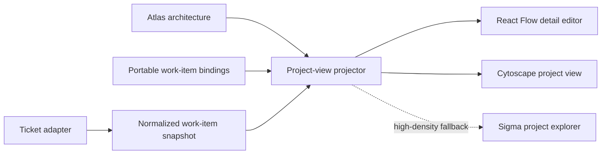

# Visualization platform for architecture and ticket overlays

**Decision status:** recommended direction, September 12, 2026

## Recommendation

Keep Atlas as a web application for the next stage. Add a renderer-neutral project-view model, keep React Flow for detailed UML editing, and prototype a Cytoscape.js renderer for a new read-oriented **Project Direction** view. Use ELK.js when the current layout engine can no longer place compound groups and explicit ports reliably.

A desktop wrapper would improve installation, credential storage, file watching, and background synchronization. It would not fix the present rendering limit because Tauri and Electron still display a web interface. A native Qt rewrite could raise the ceiling for a very large 2D scene, but its cost and licensing obligations are not justified by the current workload.

The first implementation should aggregate work rather than draw every ticket as a permanent graph node. At normal overview zoom, each diagram or architecture element should show status counts and its most urgent item. Selecting or zooming into an area can reveal ticket cards and their bindings. An unmapped-work tray should keep tickets visible even when Atlas cannot place them.

## The problem has three separate parts

1. **Data integration:** read tickets, normalize their statuses, and refresh them without changing the architecture revision.
2. **Projection:** decide which architecture areas are visible and whether their tickets appear as counts, badges, clusters, or individual cards.
3. **Rendering:** draw and interact with the projected graph.

Changing the renderer solves only the third part. A giant canvas remains hard to understand even when it renders at 60 frames per second. The projection layer is therefore the main design decision.



## Proposed data boundary

Mutable ticket state should not live in `architecture.json`. Status changes would otherwise create architecture revisions and noisy diffs. Use two additional stores:

- `atlas-work-links.json`: portable, reviewable bindings between work items and diagram, node, or edge IDs.
- `.atlas/integrations/<source>/snapshot.json`: refreshable ticket data, excluded from Git and architecture history.

The minimum normalized work item is:

```json
{
  "key": "tracker:ABC-123",
  "title": "Add retry policy",
  "url": "https://tracker.example/ABC-123",
  "status": "blocked",
  "rawStatus": "Waiting on platform",
  "priority": "high",
  "updatedAt": "2026-09-12T15:00:00Z"
}
```

A binding needs only a work-item key, an Atlas target, and an optional note. Atlas should allow explicit bindings and agent suggestions, but it does not need perfect automated correspondence with the codebase. Missing and stale bindings are expected states.

Normalized statuses should be a small closed set: `backlog`, `ready`, `active`, `blocked`, `review`, `done`, and `canceled`. Preserve the source system's status in `rawStatus` so the adapter does not discard meaning.

## Project Direction interaction

The Project Direction view should be derived from the Project Overview and current ticket snapshot.

| Scale | Architecture display | Work display |
| --- | --- | --- |
| Whole project | Diagram cards and their relationships | Status ring, counts, highest-priority item, blocked marker |
| Focused diagram | Main nodes and edges | Small ticket clusters attached to targets |
| Selected target | Local neighborhood | Individual ticket cards, status, owner, and direct tracker link |

Filters should include status, priority, age, and assignee. Selecting a ticket should highlight its architecture target and immediate dependencies. Selecting an architecture element should open its ordered work queue. Tickets without a valid binding belong in an always-available **Unmapped work** tray.

This view is read-oriented. Architecture edits should continue in the diagram editor. Ticket edits can open the source tracker or use a later adapter command with its own review rules.

## Renderer assessment

| Option | Best use | Strengths | Material limits | License |
| --- | --- | --- | --- | --- |
| **React Flow** | Detailed UML editing | Existing integration, rich React nodes, handles, labels, grouping, accessibility | DOM-rich nodes and SVG edges become costly at high visible counts; requires memoization, collapsed trees, simpler styles, and visible-element rendering | MIT |
| **Cytoscape.js** | Project Direction overview | Canvas renderer, compound nodes, JSON model, selectors, graph algorithms, many layouts and extensions | Rich HTML-like cards require custom work; compound nodes and complex styles reduce performance | MIT for core and first-party extensions |
| **Sigma.js + Graphology** | Very large dependency exploration | WebGL, thousands to tens of thousands of simple nodes and edges, graph algorithms, layered rendering | Weak fit for compound UML cards, ports, and editing; custom rendering is lower-level | MIT |
| **ELK.js** | Shared automatic layout | Directed layered layout, explicit ports, compound graphs, cross-hierarchy edges, Web Worker support | Layout engine only; EPL obligations must be carried in a distribution | EPL-2.0 |
| **Sprotty / Eclipse GLSP** | Full graphical-language workbench | Ports, labels, compartments, client/server model, ELK integration, extensible editing | Replaces much of Atlas's existing model/server/editor architecture; SVG does not address the high-density case | EPL-2.0 |
| **PixiJS** | Custom GPU scene | WebGL/WebGPU, flexible text and primitives, MIT | Atlas would have to rebuild graph layout, selection, ports, accessibility, labels, and editor behavior | MIT |
| **Qt Graphics View** | Native, extremely large 2D scenes | Spatial indexing, custom items, real-time large scenes | Full C++/Python UI rewrite; LGPL/GPL compliance is more involved and some modules are GPL-only | LGPL-3.0/GPL/commercial, depending on modules |

### Why Cytoscape.js is the next prototype

Cytoscape.js has the closest match to the Project Direction view. It uses a bitmap canvas, supports compound parent-child nodes, serializable JSON, selection and viewport events, stylesheet-driven status changes, and layouts on graph subsets. Its documentation also states the tradeoffs plainly: edges, compound nodes, overlays, high pixel ratios, and complex styles are expensive. That makes it suitable for a measured prototype rather than an unconditional replacement.

React Flow remains the better detailed editor because Atlas already uses custom React nodes for UML compartments, inspector selection, handles, embedded diagrams, and structural review. Its current documentation recommends memoization, collapsing large trees, simplifying styles, and optionally rendering only visible elements. Those measures should be applied before replacing it.

Sigma.js is compelling only if users must inspect thousands of simultaneously visible, visually simple relationships. It is designed for that scale with WebGL, but Atlas would surrender much of the current UML presentation and editing behavior.

ELK.js addresses the recurring layout and port-routing problems independently of the renderer. It can feed positions and routes into React Flow or Cytoscape.js. Adopting it would replace a growing collection of local layout rules with a configurable layout engine, while Atlas's geometry complaints remain useful as acceptance tests.

## Desktop assessment

Desktop packaging and rendering technology should be decided separately.

- **Tauri** uses the operating system webview and is MIT or Apache-2.0 licensed. It offers small bundles and controlled native capabilities, but webview versions vary by platform.
- **Electron** bundles Chromium and Node.js under an MIT-licensed framework. It gives a consistent browser engine and straightforward reuse of Atlas's Node server, with a larger distribution and the third-party notices that accompany Chromium and Node.
- **Qt Graphics View** is a native scene framework designed for large numbers of interactive 2D items, but it requires a rewrite and LGPL/GPL compliance work.

Choose a desktop shell when Atlas needs managed credentials, background tracker synchronization, operating-system menus, file watching, deep links, or a one-click installer. Choose a native renderer only after a Canvas/WebGL prototype fails a measured workload. Packaging the existing React Flow page in Tauri or Electron does not change React Flow's DOM and SVG costs.

If Atlas needs a desktop shell later, Tauri is the first candidate for a small local tool. Electron is preferable if identical Chromium behavior and direct Node integration prove more valuable than package size.

## Benchmark before committing to a renderer

Build one renderer-neutral fixture generator and feed the same projected view into React Flow and Cytoscape.js. Use four tiers:

| Tier | Architecture elements | Tickets in snapshot | Maximum individually visible tickets |
| --- | ---: | ---: | ---: |
| Current | 30 | 100 | 20 |
| Medium | 100 | 1,000 | 75 |
| Large | 300 | 5,000 | 200 |
| Stress | 1,000 | 20,000 | 1,000 |

Measure initial render, layout time, filter-to-paint time, 95th-percentile pan/zoom frame time, selection latency, and memory after ten filter cycles. Run with labels and status decoration enabled. Record the browser, operating system, screen pixel ratio, and fixture seed.

These are decision gates rather than claims about library capacity:

- Keep React Flow for a view if its 95th-percentile interaction frame stays below 20 ms and selection/filter feedback stays below 100 ms.
- Use Cytoscape.js for the overview when React Flow fails those targets but the Canvas version passes them with compound groups and readable labels.
- Use Sigma.js only when the required visible graph is too large for Cytoscape.js and simplified glyphs are acceptable.
- Consider native rendering only if aggregation plus WebGL still fails the required workload.

## Staged implementation

1. Define `WorkItem`, `WorkItemBinding`, normalized status, and adapter contracts. Add one fixture adapter before connecting the user's live tracker.
2. Add the Project Direction projection and an Unmapped work tray. Render aggregate status on the existing Project Overview with React Flow.
3. Add measurement hooks and synthetic fixtures. Enable React Flow's visible-element rendering and memoize ticket decorations.
4. Build a read-only Cytoscape.js prototype behind the same projection interface. Compare it side by side with React Flow using the benchmark above.
5. Choose the overview renderer from measurements. Keep the detailed UML editor on React Flow unless its own workload fails.
6. Evaluate Tauri only when installation, credential storage, or background synchronization becomes a product requirement.

## License notes

No candidate library was added to Atlas during this study. If adopted, preserve its license text and include its exact installed dependency tree in `THIRD_PARTY_NOTICES.md` and `LICENSES/`.

- React Flow: [MIT license](https://github.com/xyflow/xyflow/blob/main/LICENSE)
- Cytoscape.js: [MIT license](https://github.com/cytoscape/cytoscape.js/blob/master/LICENSE)
- Sigma.js: [MIT license](https://github.com/jacomyal/sigma.js/blob/main/LICENSE.txt)
- Graphology: [MIT license](https://github.com/graphology/graphology/blob/master/LICENSE.txt)
- PixiJS: [MIT license](https://github.com/pixijs/pixijs/blob/dev/LICENSE)
- ELK.js: [EPL-2.0 license](https://github.com/kieler/elkjs/blob/master/LICENSE.md)
- Sprotty: [EPL-2.0 project record](https://projects.eclipse.org/projects/ecd.sprotty)
- Tauri: [MIT or Apache-2.0](https://v2.tauri.app/concept/architecture/)
- Electron: [MIT framework](https://www.electronjs.org/docs/latest/why-electron); a packaged runtime also needs notices for Chromium, Node.js, and their components.
- Qt: [open-source licensing and obligations](https://www.qt.io/development/open-source-lgpl-obligations)

## Primary sources

- [React Flow performance guidance](https://reactflow.dev/learn/advanced-use/performance)
- [React Flow visible-element option](https://reactflow.dev/api-reference/react-flow)
- [React Flow sub-flows](https://reactflow.dev/learn/layouting/sub-flows)
- [Cytoscape.js documentation and performance guidance](https://js.cytoscape.org/)
- [Sigma.js documentation](https://www.sigmajs.org/docs/)
- [Sigma.js rendering layers](https://www.sigmajs.org/docs/advanced/layers/)
- [ELK.js project documentation](https://github.com/kieler/elkjs)
- [ELK layered algorithm](https://eclipse.dev/elk/reference/algorithms/org-eclipse-elk-layered.html)
- [Eclipse GLSP graphical model](https://eclipse.dev/glsp/documentation/gmodel/)
- [Tauri architecture](https://v2.tauri.app/concept/architecture/)
- [Electron documentation](https://www.electronjs.org/docs/latest/)
- [Qt Graphics View](https://doc.qt.io/qt-6/graphicsview.html)
